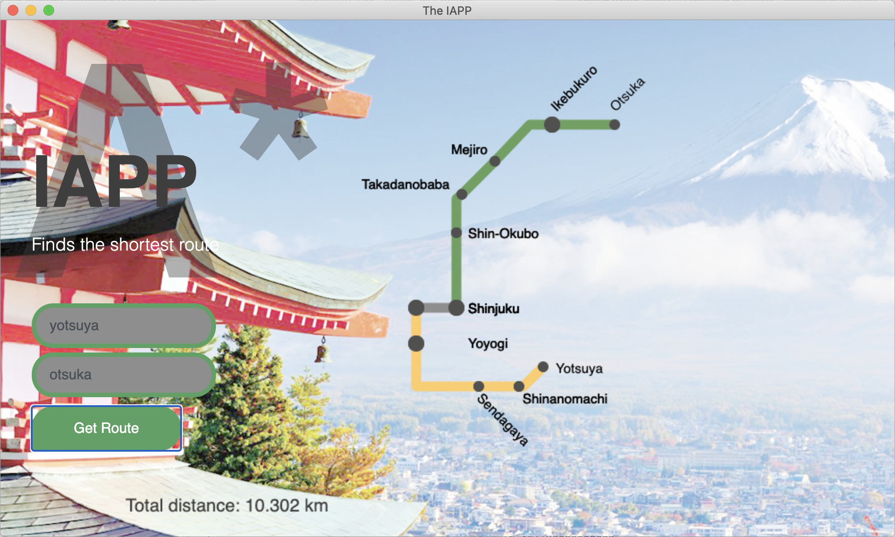

# metro_japon
App for finding the shortest distance (using A*) between two stations of a reduce Tokio subway.

## Interface

GUI before searching


---

GUI when looking for a wrong station.


---

GUI after searching



## Dependencies
```
geopy, eel
```
## Usage
```
python3 metro.py
```
